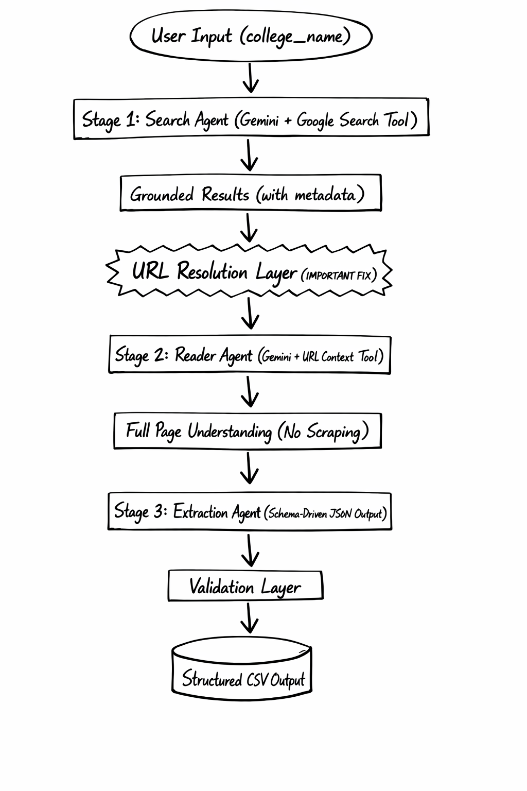

# University_Aggregator

University Aggregator is a Python-based data collection tool that discovers and extracts information about non-degree cybersecurity certificate programs from official university sources and saves the results in CSV format.

## Architecture Design



## Installation and Run

### 1) Clone repository

```bash
git clone git@github.com:Rustix69/University_Aggregator.git
cd University_Aggregator
```

### 2) Setup and run backend API

```bash
cd backend
python3 -m venv venv
source venv/bin/activate
pip install -r requirements.txt
```

Create a `.env` file inside `backend`:

```env
GEMINI_API_KEY=your_api_key_here
```

Start backend server:

```bash
uvicorn app.api:app --reload --port 8000
```

Backend will be available at `http://127.0.0.1:8000`.

### 3) Setup and run frontend

Open a new terminal:

```bash
cd frontend
npm i
npm run dev
```

Frontend will be available at `http://127.0.0.1:8080`.

If needed, set frontend API base URL in `frontend/.env`:

```env
VITE_API_BASE_URL=http://127.0.0.1:8000
```

### 4) Optional: run backend as CLI script

You can still run the extractor directly:

```bash
cd backend/app
python main.py
```

Output files are generated under `backend/app/outputs/<university_name_slug>/` when a valid non-degree certificate program is found.

## Tech Stack

- Python
- Pandas
- Google GenAI SDK (`google-genai`)
- python-dotenv
- IPython
- Gemini 2.5 Pro model with Google Search and URL Context tools
